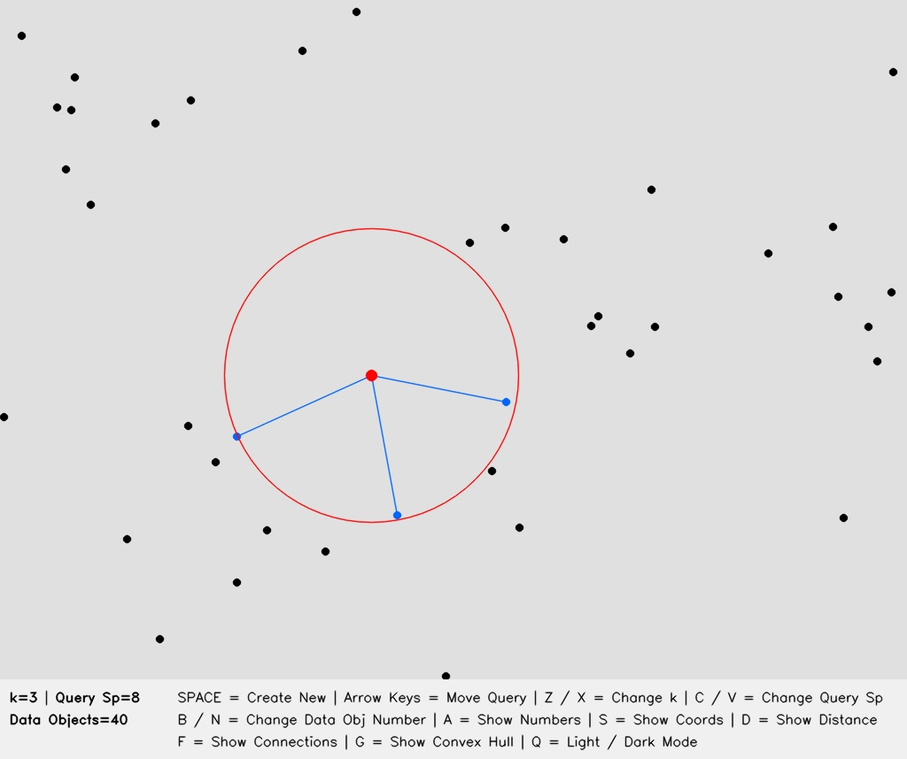
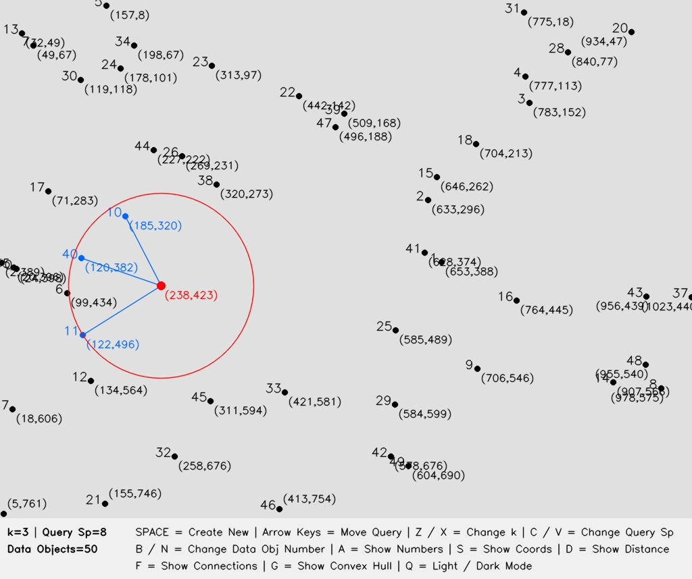
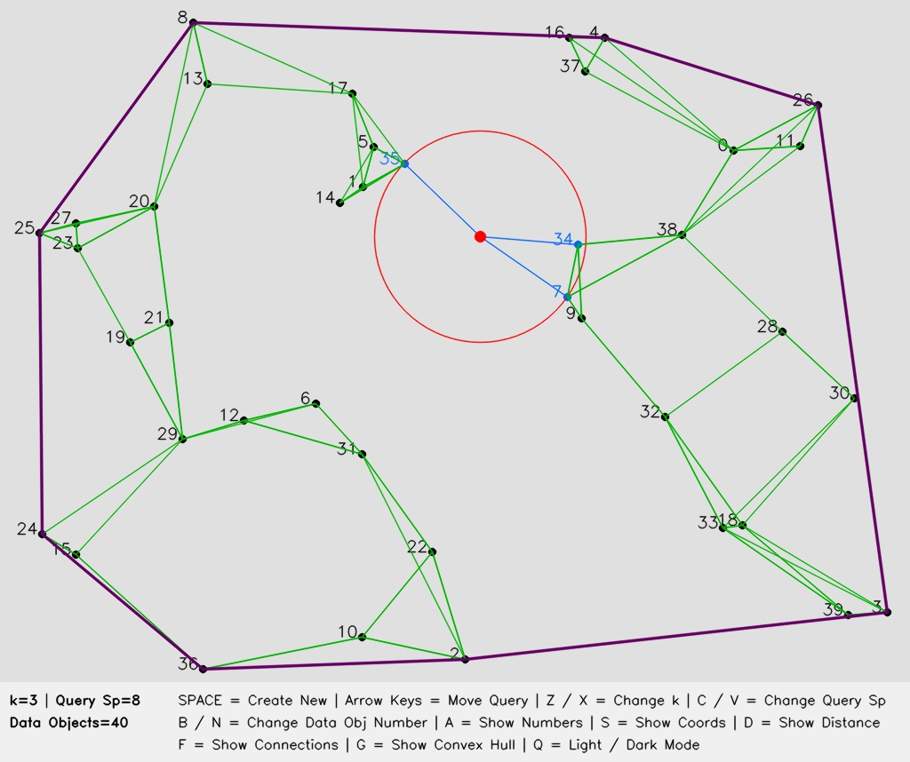
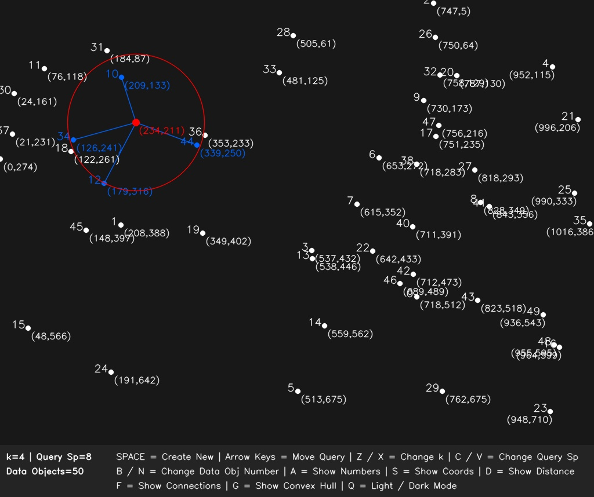

# k-Nearest Neighbors in Python

_**k-Nearest Neighbors Algorithm - Python Version**_

Hi everyone! This is the **REMAKE** edition of my k-Nearest Neighbors (kNN) algorithm; this time it was implemented in **Python** language. It simulates in the 2-dimensional open plain space where there are many data objects distributed randomly and a query object selects its k nearest data objects by the shortest distance calculations.

Although kNN is known as a Machine Learning classification algorithm, being a simple and effective, easy to implement and yielding satisfactory results, here it is designed for **proximity querying**.

For details about my original kNN implementation which was written in **Java**, please click here.

## Screenshots

<!-- 





 -->

## Features

As noticed in the screenshots above, there are several data objects (black dots in light mode; white dots in dark mode), and the query object (red dot), plus the important part which is to have k nearest data objects (blue dots and blue lines) selected by the query object. A red circle is also drawn, which is centered at the query objects, to demonstrate how large the area is scanned to encompass such k nearest objects tıgether and as expected, the maximum shortest distance determines the radius of the circle. Lasly, by the movement of the query object, the kNN result is updated accordingly.

**Here are the features that a user can perform without closing and re-running the script:**

* Creation of new data objeects and the query object, at fully randomized positions.
* Movement of the query objects in four directions (left, right, up & down) to obtain different kNN output.
* Yielding the kNN results at the specified coordinates with a mouse click on the plain space.
* Showing the ID numbers of all data objects.
* Showing the (x,y) coordinates of all data objects and the query object.
* Showing the shortest distances of k nearest data objects in the output.
* Changing the k value, total number of data objects, and movement speed of the query object.
* Observing the kNN connectivity generated by all data objects.
* Observing the convex hull derived from the data objects.
* Support for switching between light & dark modes.

Everything in the codebase was written meticulously and carefully from scratch in **Python language** and **OpenCV library** composed the infrastructure of this application. One importance is to deliver the same features and usages as it was in Java version. The other importance is to be able to give a modern apporach of app development because Java applet already became obsolete and almost nobody dealt with such components any more!

## Usage

After cloning this repository, all you have to do is to enter the command below to run the kNN script (with no additional arguments):

```
python knn_python.py
```
